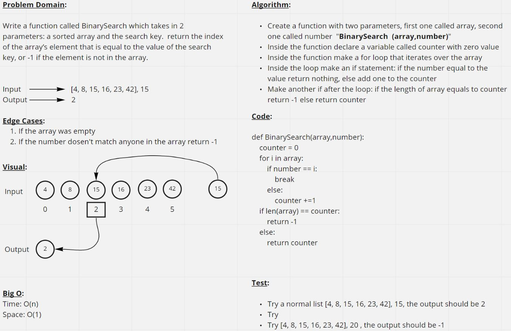

# Code Challenge 03: Binary search in a sorted 1D array

**Task:** Write a function called BinarySearch which takes in 2 parameters: a sorted array and the search key. Without utilizing any of the built-in methods available to your language, return the index of the array’s element that is equal to the value of the search key, or -1 if the element is not in the array.

&nbsp;

**PR Link:** <https://github.com/YAHIAQOUS/data-structures-and-algorithms/pull/19>

&nbsp;

