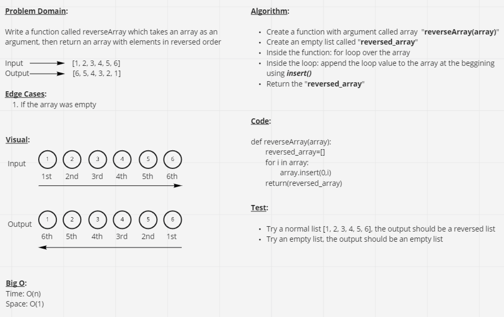

# Code Challenge 01: Reverse an array

**Task:** Write a function called reverseArray which takes an array as an argument. Without utilizing any of the built-in methods available to your language, return an array with elements in reversed order.

&nbsp;

**Whiteboard link:** <https://miro.com/app/board/o9J_l5RQrH8=/>

&nbsp;

**PR Link:** <https://github.com/YAHIAQOUS/data-structures-and-algorithms/pull/18>

&nbsp;

