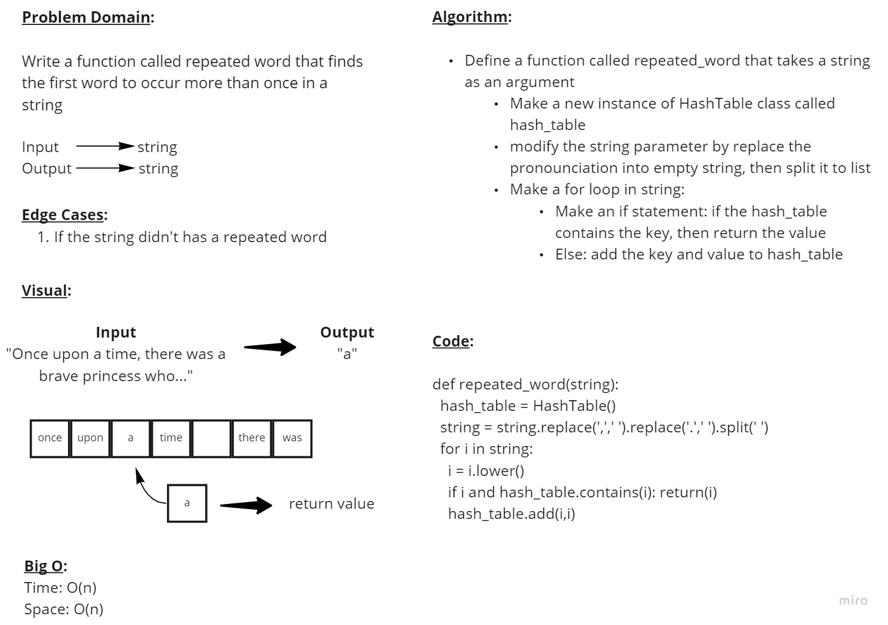

# Hash Tables

## Code Challenge 30

### **Feature Tasks**

Implement a Hashtable Class with the following methods:

&nbsp;

- **add**
  - Arguments: key, value
  - Returns: nothing
  - This method should hash the key, and add the key and value pair to the table, handling collisions as needed.

&nbsp;

- **get**
  - Arguments: key
  - Returns: Value associated with that key in the table

&nbsp;

- **contains**
  - Arguments: key
  - Returns: Boolean, indicating if the key exists in the table already.

&nbsp;

- **hash**
  - Arguments: key
  - Returns: Index in the collection for that key

&nbsp;

### **PR Link**

<https://github.com/YAHIAQOUS/data-structures-and-algorithms/pull/54>

&nbsp;

## Code Challenge 30

### **Feature Tasks**

- Write a function called repeated word that finds the first word to occur more than once in a string

- Arguments: string

- Return: string

&nbsp;

### **Whiteboard Process**

&nbsp;

### **PR Link**

<https://github.com/YAHIAQOUS/data-structures-and-algorithms/pull/55>

&nbsp;
