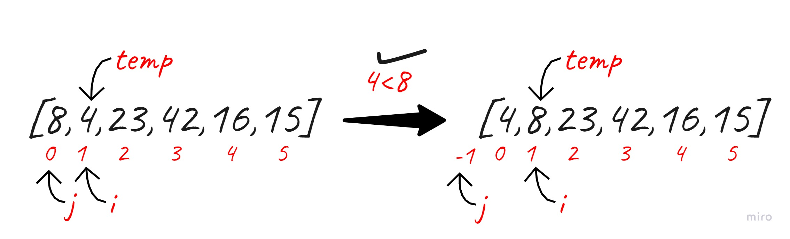
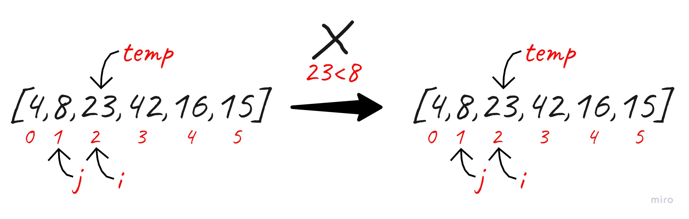
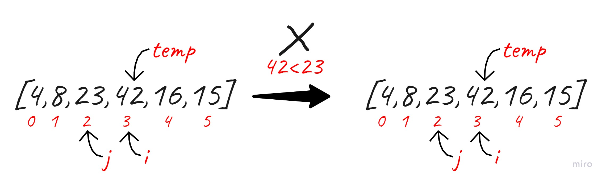
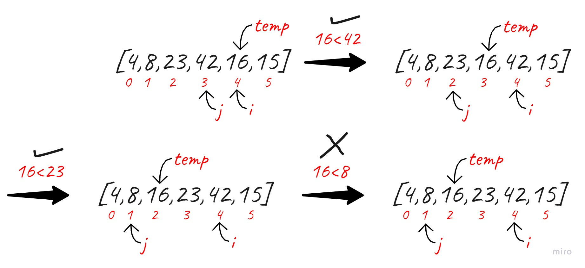
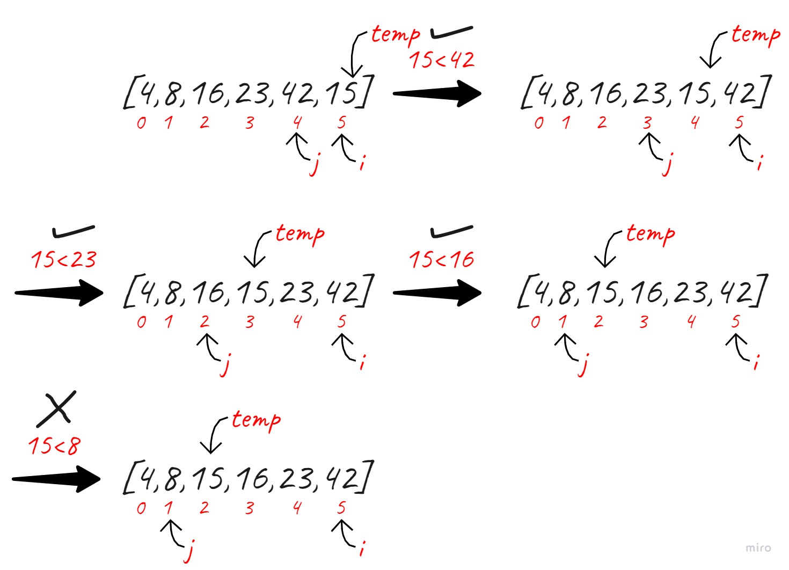

# Insertion Sort

Insertion sort is the sorting mechanism where the sorted array is built having one item at a time. The array elements are compared with each other sequentially and then arranged simultaneously in some particular order.

&nbsp;

## Pseudocode

    InsertionSort(int[] arr)

      FOR i = 1 to arr.length

        int j <-- i - 1
        int temp <-- arr[i]

        WHILE j >= 0 AND temp < arr[j]
          arr[j + 1] <-- arr[j]
          j <-- j - 1

        arr[j + 1] <-- temp

&nbsp;

## Trace

**Sample Array: [8,4,23,42,16,15]**

### Pass01

The 1st pass we compare if temp which is value of index 1 is smaller than value of index 0, 4<8 which is right. So the value of index 1 will equal value of index 0 and vis versa. Then j<0 the loop will end.

&nbsp;

### Pass02

The 2nd pass we compare if temp which is value of index 2 is smaller than value of index 1, 23<8 which is wrong. So the values will be as is.

&nbsp;

### Pass03

The 3rd pass we compare if temp which is value of index 3 is smaller than value of index 2, 42<23 which is wrong. So the values will be as is.

&nbsp;

### Pass04

The 4th pass we compare if temp which is value of index 4 is smaller than value of index 3, 16<42 which is right. So the value of index 4 will equal value of index 3 and vis versa.

Then we compare if temp which is value of index 3 is smaller than value of index 2, 16<23 which is right. So the value of index 3 will equal value of index 2 and vis versa.

Then we compare if temp which is value of index 2 is smaller than value of index 1, 16<8 which is wrong. So the values will be as is.

&nbsp;

### Pass05

The 5th pass we compare if temp which is value of index 5 is smaller than value of index 4, 15<42 which is right. So the value of index 5 will equal value of index 4 and vis versa.

Then we compare if temp which is value of index 4 is smaller than value of index 3, 15<23 which is right. So the value of index 4 will equal value of index 3 and vis versa.

Then we compare if temp which is value of index 3 is smaller than value of index 2, 15<16 which is right. So the value of index 3 will equal value of index 2 and vis versa.

Then we compare if temp which is value of index 2 is smaller than value of index 1, 15<8 which is wrong. So the values will be as is.

&nbsp;

## Efficency

- **Time: O(n^2)**

  - The basic operation of this algorithm is comparison. This will happen n \* (n-1) number of times…concluding the algorithm to be n squared.

&nbsp;

- **Space: O(1)**

  - No additional space is being created. This array is being sorted in place…keeping the space at constant O(1).
