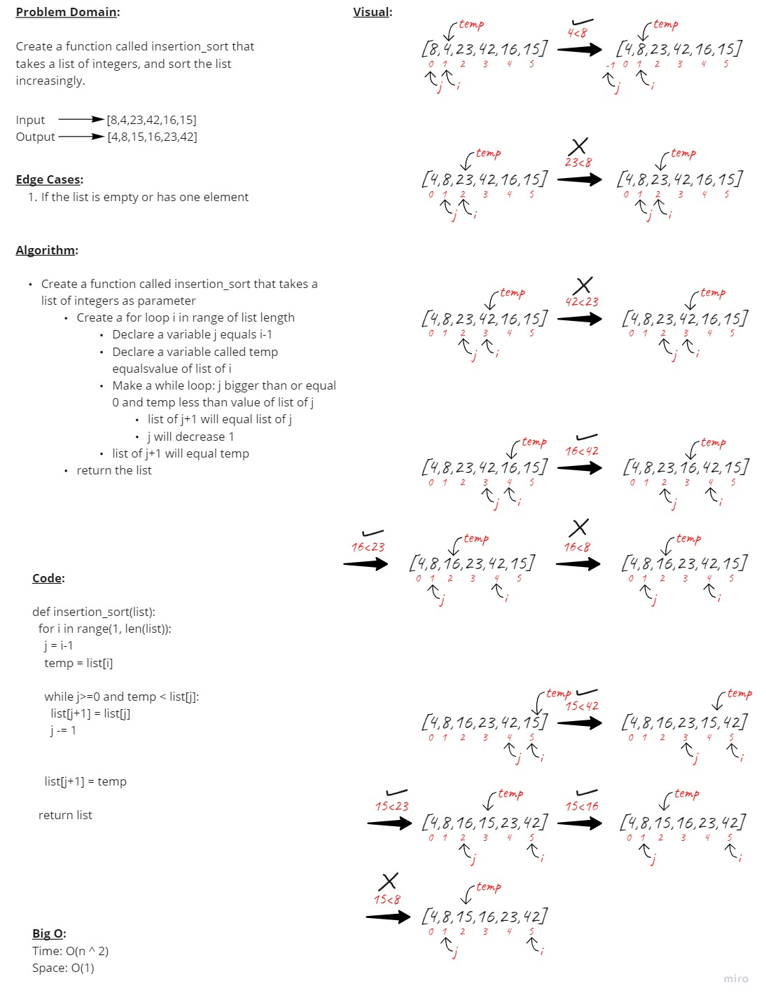

# Insertion Sort

## Code Challenge 26

### **Feature Tasks**

- Review the pseudocode below, then trace the algorithm by stepping through the process with the provided sample array. Document your explanation by creating a blog article that shows the step-by-step output after each iteration through some sort of visual.

      InsertionSort(int[] arr)

        FOR i = 1 to arr.length

          int j <-- i - 1
          int temp <-- arr[i]

          WHILE j >= 0 AND temp < arr[j]
            arr[j + 1] <-- arr[j]
            j <-- j - 1

          arr[j + 1] <-- temp

- Provide a visual step through for each of the sample arrays based on the provided pseudo code

- Convert the pseudo-code into working code in your language

- Present a complete set of working tests

&nbsp;

### **Whiteboard Process**

&nbsp;

### **PR Link**

<https://github.com/YAHIAQOUS/data-structures-and-algorithms/pull/51>
