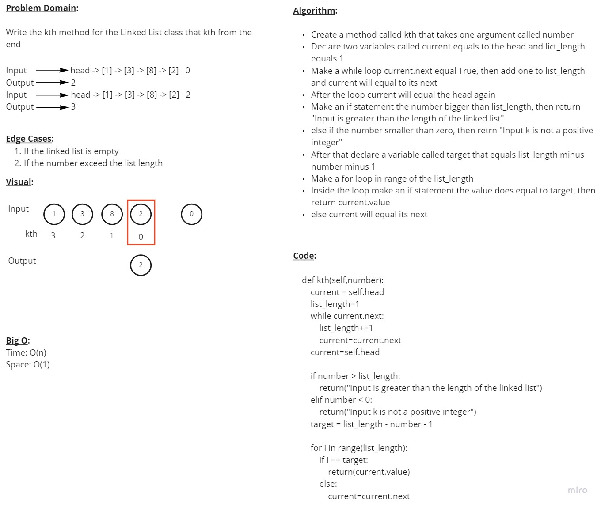

# Linked Lists

## Code Challenge 06

### **Feature Tasks**

Write the following methods for the Linked List class:

-   **append**

    arguments: new value

    adds a new node with the given value to the end of the list

-   **insert before**

    arguments: value, new value

    adds a new node with the given new value immediately before the first node that has the value specified

-   **insert after**

    arguments: value, new value

    adds a new node with the given new value immediately after the first node that has the value specified

&nbsp;

### **WhiteBoard**

&nbsp;

### **PR Link**

<https://github.com/YAHIAQOUS/data-structures-and-algorithms/pull/39>

&nbsp;

## Code Challenge 07

### **Feature Tasks**

Write the following method for the Linked List class:

-   **kth from end**

    argument: a number, k, as a parameter.

    adds a new node with the given value to the end of the list

&nbsp;

### **WhiteBoard**

&nbsp;

### **PR Link**

<https://github.com/YAHIAQOUS/data-structures-and-algorithms/pull/40>
