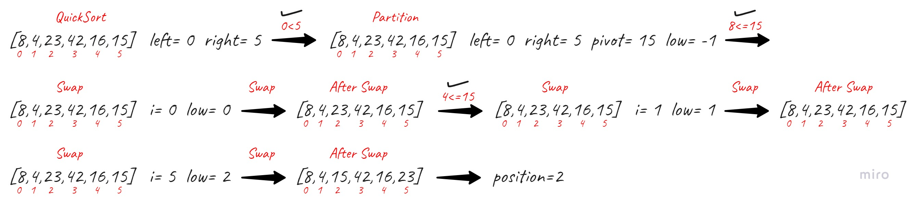
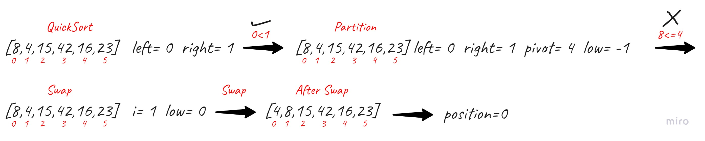
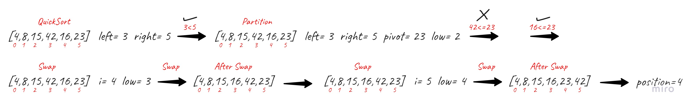
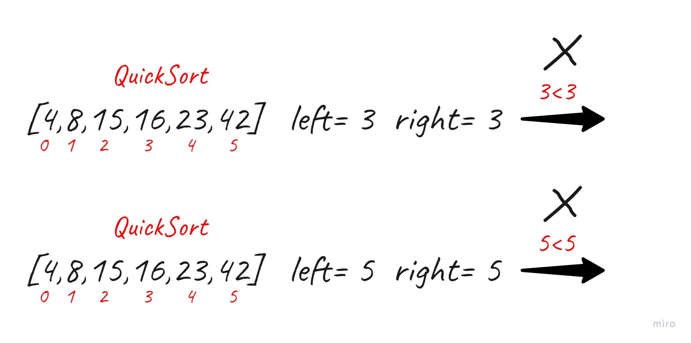

# Merge Sort

Quicksort is a divide-and-conquer algorithm. It works by selecting a 'pivot' element from the array and partitioning the other elements into two sub-arrays, according to whether they are less than or greater than the pivot.

&nbsp;

## Pseudocode

    ALGORITHM QuickSort(arr, left, right)
        if left < right
            // Partition the array by setting the position of the pivot value
            DEFINE position <-- Partition(arr, left, right)
            // Sort the left
            QuickSort(arr, left, position - 1)
            // Sort the right
            QuickSort(arr, position + 1, right)

    ALGORITHM Partition(arr, left, right)
        // set a pivot value as a point of reference
        DEFINE pivot <-- arr[right]
        // create a variable to track the largest index of numbers lower than the defined pivot
        DEFINE low <-- left - 1
        for i <- left to right do
            if arr[i] <= pivot
                low++
                Swap(arr, i, low)

        // place the value of the pivot location in the middle.
        // all numbers smaller than the pivot are on the left, larger on the right.
        Swap(arr, right, low + 1)
        // return the pivot index point
        return low + 1

    ALGORITHM Swap(arr, i, low)
        DEFINE temp;
        temp <-- arr[i]
        arr[i] <-- arr[low]
        arr[low] <-- temp

&nbsp;

## Trace

**Sample Array: [8,4,23,42,16,15]**

### Pass01

&nbsp;

### Pass02

&nbsp;

### Pass03

&nbsp;

### Pass04

&nbsp;

### Pass05

&nbsp;

## Efficency

- **Time: O(n^2)**

  - The basic operation of this algorithm is comparison. This will happen n \* (n-1) number of times…concluding the algorithm to be n squared.

&nbsp;

- **Space: O(1)**

  - No additional space is being created. This array is being sorted in place…keeping the space at constant O(1).
