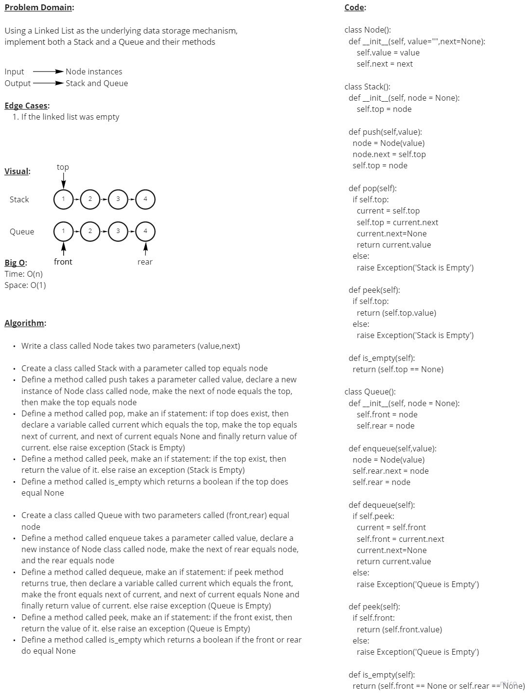
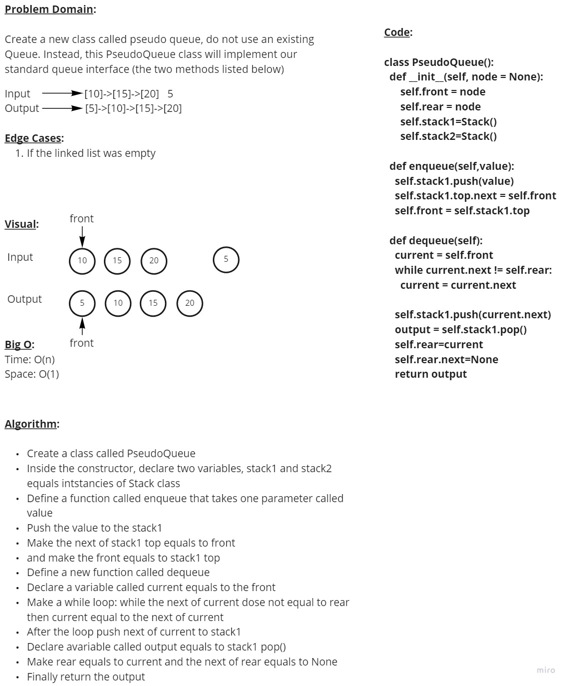
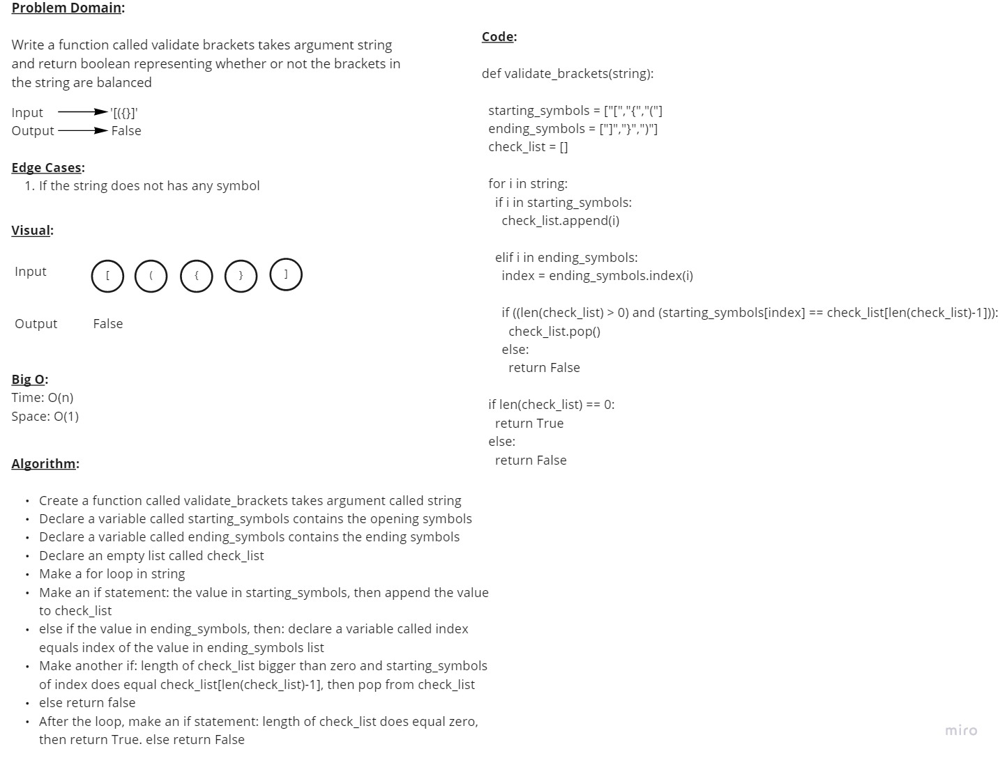

# Stacks and Queues

## Code Challenge 10

### **Feature Tasks**

Using a Linked List as the underlying data storage mechanism, implement both a Stack and a Queue and their methods

&nbsp;

### **WhiteBoard**

&nbsp;

### **PR Link**

<https://github.com/YAHIAQOUS/data-structures-and-algorithms/pull/44>

&nbsp;

## Code Challenge 11

### **Feature Tasks**

Create a new class called pseudo queue.

- Do not use an existing Queue.

- Instead, this PseudoQueue class will implement our standard queue interface

- Internally, utilize 2 Stack instances to create and manage the queue

### **WhiteBoard**

&nbsp;

### **PR Link**

<https://github.com/YAHIAQOUS/data-structures-and-algorithms/pull/45>

&nbsp;

## Code Challenge 13

### **Feature Tasks**

Write a function called **validate_brackets**

Arguments: **string**

Return: **boolean**

representing whether or not the brackets in the string are balanced

&nbsp;

### **WhiteBoard**

&nbsp;

### **PR Link**

<https://github.com/YAHIAQOUS/data-structures-and-algorithms/pull/42>
