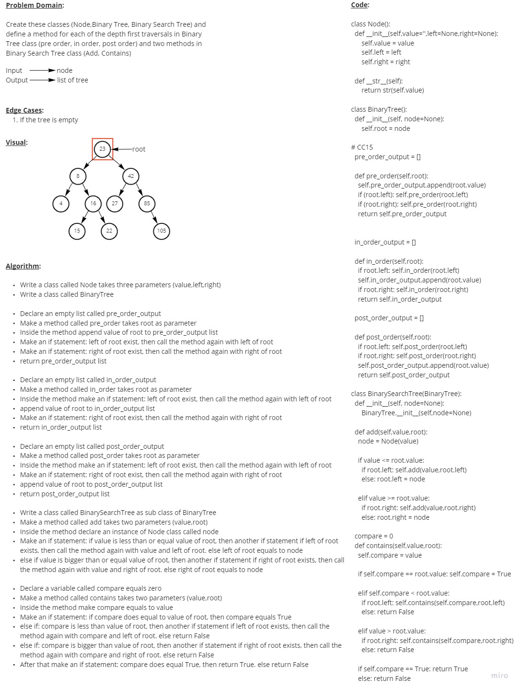
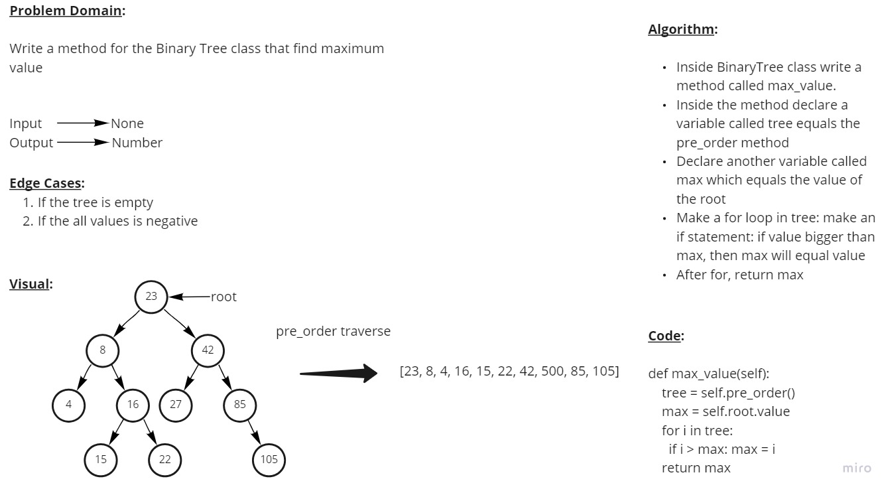

# Trees

## Code Challenge 15

### **Feature Tasks**

- **Node**

  - Create a Node class that has properties for the value stored in the node, the left child node, and the right child node.

- **Binary Tree**

  - Create a Binary Tree class

    - Define a method for each of the depth first traversals:

      - pre order
      - in order
      - post order

    - which returns an array of the values, ordered appropriately.

  - Any exceptions or errors that come from your code should be semantic, capture-able errors. For example, rather than a default error thrown by your language, your code should raise/throw a custom, semantic error that describes what went wrong in calling the methods you wrote for this lab.

- **Binary Search Tree**

  - Create a Binary Search Tree class

    - This class should be a sub-class (or your languages equivalent) of the Binary Tree Class, with the following additional methods:

    - Add

      - Arguments: value
      - Return: nothing
      - Adds a new node with that value in the correct location in the binary search tree.

    - Contains

      - Argument: value
      - Returns: boolean indicating whether or not the value is in the tree at least once.

&nbsp;

### **Whiteboard Process**

&nbsp;

### **PR Link**

<https://github.com/YAHIAQOUS/data-structures-and-algorithms/pull/47>

&nbsp;

## Code Challenge 16

### **Feature Tasks**

- Write the following method for the Binary Tree class

  - Define a method for each of the depth first traversals:

    - Arguments: none
    - Returns: number

&nbsp;

### **Whiteboard Process**

&nbsp;

### **PR Link**

<https://github.com/YAHIAQOUS/data-structures-and-algorithms/pull/48>

&nbsp;

## Code Challenge 17

### **Feature Tasks**

- Write a function called breadth first
- Arguments: tree
- Return: list of all values in the tree, in the order they were encountered

&nbsp;

### **Whiteboard Process**

<!--  -->

&nbsp;

### **PR Link**

<https://github.com/YAHIAQOUS/data-structures-and-algorithms/pull/49>
